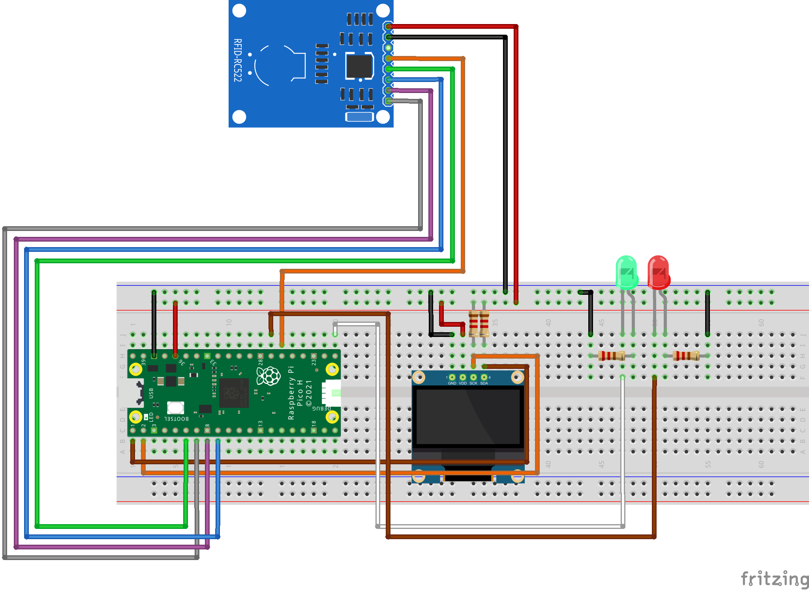

# Build the reader

## Ingredients
To build the reader you'll need :
- A Raspeberry pi pico
- A RC522 RFID reader card
- A SSD1306 OLED display
- A Green led with its resistor
- A Red led with its resistor
- A systeme to open a door
- Some cables and a breadboard for prototyping 
- A cable to connect your computer to the Pi Pico
- Thonny installed on your computer.
- The content of the [Client folder](../Client/)

## Assemble the components
Now you can assemble the parts using the schemas.
You can plug you openning relays at the same PIN as the green LED.
 



## Program the Pi Pico

You can follow this guide from the raspebery py blog to initialize your Pi Pico   
➡️[Here it is](https://projects.raspberrypi.org/en/projects/get-started-pico-w/1)  
⚠️ I cannot guarantee the accuracy of the information contained in this guide. ⚠️

Now that you Pi Pico is fully operationnal, you can upload the content of the [Client folder](../Client/) to it.

⚠️ The WIFI network **MUST** be available in 2.4 Ghz
⚠️ Don't forget to create the file env.py with this content  

``` python
# Global variables
DOOR_ID = '[Your door ID]' #Without the quote
WLAN_SSID = '[Your SSID]'
WLAN_PASS = '[Your password]'
SERVER_IP = '[Your server IP]'
SERVER_PORT = 5000
```

